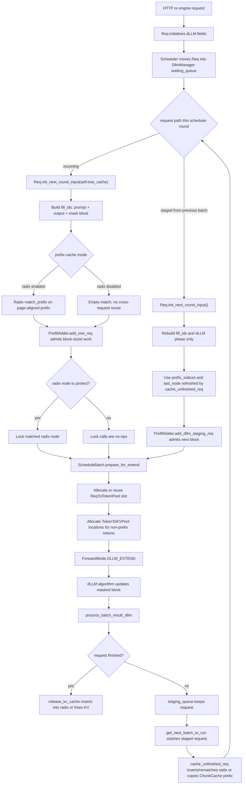

# How dLLM Requests Use KV Cache With and Without Radix Cache in SGLang

This note explains the diffusion language model, or dLLM, request path from the
viewpoint of KV cache ownership, radix-tree prefix reuse, and the disabled radix
cache path. It is written for contributors who need to work on the scheduler,
memory cache, or dLLM decoding code.

The relevant implementation is in these areas:

- `python/sglang/srt/dllm/`: dLLM config, request mixins, scheduler mixins, and decoding algorithms.
- `python/sglang/srt/managers/schedule_batch.py`: request state, batch construction, and KV allocation setup.
- `python/sglang/srt/managers/schedule_policy.py`: `PrefillAdder` admission and budgeting.
- `python/sglang/srt/mem_cache/`: radix cache, disabled-cache `ChunkCache`,
  allocators, request-to-token mapping, and release helpers.
- `python/sglang/srt/model_executor/forward_batch_info.py`: `DLLM_EXTEND` forward metadata.

This page focuses on diffusion language models for text generation, not the
image/video SGLang Diffusion stack.

## Mental model

Autoregressive decoding appends one or more tokens to the sequence and then
keeps decoding from the new tail. dLLM decoding works in block rounds instead.
For each round SGLang builds:

```text
fill_ids = origin_input_ids + output_ids + [mask_id] * block_size
```

The model repeatedly predicts tokens for the current masked block. The dLLM
algorithm accepts some or all of those block tokens, appends the accepted span to
`output_ids`, and the next scheduler round builds the next `fill_ids`.

SGLang runs dLLM through the same prefix-cache interface used by normal
generation. With radix cache enabled, that interface is backed by `RadixCache`
and reusable prefixes are indexed by token IDs. With `--disable-radix-cache`,
the interface is still present, but it does not provide cross-request prefix
sharing. The usual disabled path is `ChunkCache`, which preserves KV for the
same live request between chunked/dLLM rounds. A disabled `RadixCache` facade can
also appear when chunked prefill is not active; it returns empty matches and does
not insert cached prefixes.

The main dLLM-specific constraint is block/page alignment. In radix cache,
`page_size` is the token granularity used for cache keys and KV ownership:
radix insertion and lookup both round keys down to complete pages. In dLLM,
`block_size` is the semantic scheduling unit: each round operates on one
diffusion block, and `ForwardBatch` builds positions from
`dllm_block_offset` through `dllm_block_offset + block_size`.

Those two units must agree in the radix-enabled path. SGLang forces `page_size`
to be a multiple of the dLLM block size, normally the block size itself, so a
radix hit can only expose prefixes at dLLM block boundaries. This keeps radix
keys, allocator pages, request `prefix_indices`, and dLLM positions describing
the same sequence boundary. If a radix hit ended in the middle of a dLLM block,
the next dLLM round would reuse KV for a partial block while position generation
and mask-block scheduling treat the next work item as a full block. That would
make `dllm_block_offset`, cached KV, and the active mask block disagree, which
can produce incorrect dLLM behavior rather than just lower cache efficiency.
In the disabled path, the allocator still uses `page_size`, but there is no
radix key to insert or match, so this radix match-boundary constraint does not
apply.

## Runtime setup

dLLM mode is enabled by passing `--dllm-algorithm`, for example
`LowConfidence` or `JointThreshold`. `DllmConfig.from_server_args()` reads model
architecture specific defaults:

- `block_size`: the number of tokens processed as one dLLM block.
- `mask_id`: the token ID used to fill the next block before decoding.
- `max_running_requests`: the dLLM scheduler capacity.
- `algorithm_config`: optional YAML settings such as thresholds or an override
  for `block_size`.

Server argument validation then adjusts runtime features for this execution
mode:

- overlap scheduling is disabled;
- pipeline parallelism is forced off;
- LoRA and disaggregation are disabled;
- mixed chunked prefill is disabled;
- when radix cache is enabled, HiCache and LMCache are disabled;
- when radix cache is enabled, `page_size` is adjusted for dLLM block alignment;
- when radix cache is disabled, the scheduler uses a disabled prefix-cache
  implementation, normally `ChunkCache` when chunked prefill is active, and no
  cross-request prefix reuse is available;
- attention backend choices are adjusted for the platform and CUDA graph mode.

The scheduler stores the resolved `DllmConfig` and initializes a `DllmManager`.
The worker initializes the selected `DllmAlgorithm`. Batches created for this
path use `ForwardMode.DLLM_EXTEND`, not the normal `EXTEND` or `DECODE` mode.

## Lifecycle overview



The diagram hides some scheduler details, but it shows the important ownership
flow: incoming requests perform prefix lookup before allocation, while staged
dLLM requests do not call `match_prefix()` from
`Req.init_next_round_input()`. Instead, `get_next_batch_to_run()` first stashes
unfinished staged requests through `cache_unfinished_req(req, chunked=True)`;
the later staged call to `init_next_round_input()` only rebuilds `fill_ids` and
the dLLM phase, then reuses the refreshed `prefix_indices` and `last_node`.
Request/KV pool allocation still happens before forward, and release or cache
handoff happens after the scheduler knows which tokens are committed.

## Request phases

Each dLLM request has a `dllm_phase`:

- `INCOMING_PREFILL`
- `STAGING_PREFILL`
- `INCOMING_DECODE`
- `STAGING_DECODE`

The names are about the current dLLM block, not the generic autoregressive
prefill/decode split.

`Req.init_diffusion_llm()` sets the initial phase from prompt length. A short
prompt can start in incoming decode because it does not yet fill a complete dLLM
block. Longer inputs start in incoming prefill.

When a request is prepared for a dLLM scheduling round,
`Req.init_next_round_input()` calls the dLLM request mixin:

```text
origin_input_ids + output_ids + [mask_id] * block_size
```

Then `determine_dllm_phase()` inspects the next block after
`len(req.prefix_indices)`. For an incoming request, `prefix_indices` are set by
the `match_prefix()` call made inside `init_next_round_input(self.tree_cache)`.
For a staged request, `init_next_round_input()` is called without `tree_cache`,
so this method does not refresh the prefix; it uses the state already updated by
the preceding `cache_unfinished_req()` handoff. If the inspected block has no
mask token, it is treated as prefill-like work. If it contains mask tokens, it
is decode-like dLLM work.

`DllmManager` owns two queues:

- `waiting_queue`: dLLM requests waiting to be admitted this round.
- `staging_queue`: requests whose resources were admitted by `PrefillAdder`.

Each scheduler round moves eligible requests from the normal waiting queue into
the dLLM manager, processes either prefill-phase or decode-phase requests, and
then stages admitted requests for the next round.

## Prefix lookup before allocation

After building `fill_ids`, `Req.init_next_round_input()` computes the maximum
prefix that can be reused or carried forward:

```text
max_prefix_len = len(fill_ids) - 1
token_ids = fill_ids[:max_prefix_len]
```

The final token is excluded so logprob computation and extension semantics can
still work consistently. If positional embedding overrides are present, prefix
matching is disabled because identical token IDs could map to different input
embeddings.

When a tree-cache object is passed, the request calls the common prefix-cache
interface:

```text
tree_cache.match_prefix(
    MatchPrefixParams(
        key=RadixKey(token_ids=token_ids, extra_key=req.extra_key),
        req=req,
        cow_mamba=cow_mamba,
    )
)
```

Incoming dLLM requests take this path directly because
`process_dllm_incoming_reqs()` calls `req.init_next_round_input(self.tree_cache)`.
Passing `tree_cache` is what makes `init_next_round_input()` enter the
`match_prefix()` branch.

The result depends on the cache mode:

- Radix enabled: `RadixCache.match_prefix()` page-aligns the key before
  searching. Prefix hits are exposed at dLLM block boundaries, and
  `prefix_indices` point to KV pages owned by radix nodes.
- Radix disabled with `ChunkCache`: `match_prefix()` returns an empty match for
  new incoming requests. There is no cross-request reuse.
- Radix disabled with a disabled `RadixCache` facade: `match_prefix()` also
  returns an empty match, and `insert()`/`cache_unfinished_req()` are no-ops.

The shared match result updates request state:

- `prefix_indices`: KV pool indices for the matched or carried prefix. With
  radix enabled they are borrowed from radix-owned pages; with `ChunkCache` they
  are copied from the same request's live `ReqToTokenPool` mapping after a
  previous round.
- `last_node`: terminal radix node for the matched device prefix. This is a real
  tree node in radix mode and `None` or a root-like no-op value in disabled
  modes.
- `last_host_node` and `host_hit_length`: present for the shared cache
  interface, normally unused in the dLLM path because HiCache is disabled when
  radix is enabled.
- `cache_protected_len`: the KV range protected by a radix entry. In disabled
  modes there is no radix-protected range.

For dLLM requests, `_update_block_offset_for_dllm()` sets `dllm_block_offset`
from the matched prefix length when `tree_cache` is passed. This matters most for
radix hits. For staged requests, the offset also advances through
`_init_fill_ids_for_dllm()` as the same request moves block by block.

Staged dLLM requests are different. `DllmManager.init_next_round()` calls
`req.init_next_round_input()` without a `tree_cache` argument. That call still
rebuilds `fill_ids` and updates the dLLM phase, but it skips the
`match_prefix()` branch because `tree_cache is None`. The staged request can do
that because `cache_unfinished_req()` already performed the prior-round handoff:
radix mode inserted/rematched the page-aligned prefix, while `ChunkCache` copied
the same request's live KV locations into `req.prefix_indices`.

## Admission and KV budget

`SchedulerDllmMixin.get_new_batch_dllm()` creates a `PrefillAdder` with the
resolved `DllmConfig`. In that mode, `PrefillAdder` tracks a dLLM-specific token
budget:

```text
rem_dllm_tokens = max_running_requests * block_size
```

Incoming requests go through `process_dllm_incoming_reqs()`. Staging requests go
through `process_dllm_staging_reqs()`.

The key admission behavior is in `PrefillAdder`:

- `_get_dllm_remain_tokens()` caps work by remaining dLLM budget, one block, and
  available KV capacity.
- `_add_dllm_req()` truncates the request to a page-aligned number of tokens.
- `add_dllm_staging_req()` admits already staged work and truncates if needed.
- `add_one_req()` handles an incoming request after prefix matching and lock
  acquisition.

For an incoming dLLM request, `add_one_req()` enters the same lock path in both
cache modes. With radix enabled, the temporary lock protects the matched node
while capacity is validated. If the request is admitted, `add_one_req()` calls
`_add_dllm_req(req, prefix_len)` and then increments the lock ref for
`req.last_node` so the prefix remains protected while the request uses it. With
`ChunkCache` or a disabled radix facade, `inc_lock_ref()` and `dec_lock_ref()`
return no-op results, so the admission path is shared without protecting any
tree nodes.

That lock matters only for radix-owned KV: while a request is using a radix
prefix, the tree must not evict the KV pages backing that prefix. In the disabled
path, the active request remains the owner of its KV, so lifecycle cleanup rather
than tree eviction controls memory.

## KV cache lifecycle

The KV lifecycle is easiest to understand as a sequence of ownership transfers.

### 1. Resolve the prefix

Before any new KV memory is allocated, an incoming request asks the prefix-cache
interface for the longest usable prefix. A staged dLLM request is different: it
has already gone through `cache_unfinished_req()` while being stashed from the
previous batch, so the next staged round reuses that refreshed request state
instead of running another `match_prefix()` lookup.

With radix enabled, this is true cross-request prefix reuse. A cache hit returns
`prefix_indices`, which are already allocated locations in the token-to-KV pool.
Those indices are not copied; the request borrows them and later writes them
into its request slot mapping. The radix node remains the owner that keeps those
KV pages alive.

With radix disabled, an incoming request normally gets an empty prefix. A staged
request can still have `prefix_indices` if `ChunkCache.cache_unfinished_req()`
copied the same request's existing KV locations after the previous dLLM round.
Those indices are not shared with other requests; they are a continuation map
for the live request.

### 2. Allocate a request slot

`ScheduleBatch.prepare_for_extend()` calls `alloc_for_extend()`. The first
allocation in `alloc_for_extend()` is a request slot:

```text
req_pool_indices = req_to_token_pool.alloc(reqs)
```

`ReqToTokenPool` is the per-request position map. It does not store K/V tensors.
It stores, for each live request and sequence position, the integer location of
the corresponding KV entry in the token-to-KV pool. Staged dLLM requests have
`is_chunked` incremented by `DllmManager.increment_chunked_count()`, so the
request slot can be reused across rounds instead of being freed and reallocated
from scratch.

### 3. Allocate new KV locations

After request slots are allocated, `alloc_for_extend()` allocates KV locations
for the non-prefix part of the batch. This happens in both cache modes.

For `page_size == 1`, this is a token allocation. For `page_size > 1`, SGLang
uses paged allocation:

```text
alloc_paged_token_slots_extend(...)
```

This function overestimates by one page per request and then calls the
allocator's `alloc_extend()` method. With radix enabled, `evict_from_tree_cache()`
can reclaim unprotected radix leaves if the allocator does not have enough free
space. With `ChunkCache` or a disabled radix facade, tree eviction is a no-op, so
memory pressure is handled by normal request lifecycle cleanup.

The output is `out_cache_loc`, the KV pool locations for the tokens that will be
computed in this forward pass.

### 4. Populate the request-to-KV map

`alloc_for_extend()` writes both prefix indices and newly allocated locations
into `ReqToTokenPool`.

Conceptually the map becomes:

```text
request position:  0  1  2  3  4  5  6  7
req_to_token:     p0 p1 p2 p3 n0 n1 n2 n3
                  | prefix | | newly allocated |
```

In radix mode, `p0..p3` are radix-owned KV locations. In the disabled
`ChunkCache` path, they are request-owned KV locations carried forward from the
same request's previous round.

The attention backend later uses this mapping to find the KV pages for each
request. The model forward writes newly computed K/V tensors into `out_cache_loc`.

### 5. Run `DLLM_EXTEND`

`ScheduleBatch.prepare_for_extend()` sets `forward_mode` to `DLLM_EXTEND` for
dLLM batches. The model worker batch carries:

- `dllm_block_offsets`: one offset per request;
- `dllm_config`: including `block_size`;
- `out_cache_loc`: where newly computed K/V should be written;
- `req_pool_indices`: request slots that map positions to KV locations.

`ForwardBatch` builds positions specially for dLLM:

```text
for each request:
    positions = range(dllm_block_offset, dllm_block_offset + block_size)
```

FlashInfer metadata also treats dLLM as a ragged prefill with:

```text
prefix_lens = seq_lens - block_size
```

This tells attention that each request has a prefix plus one active dLLM block.
The prefix may be radix-reused, request-owned via `ChunkCache`, or empty.

### 6. Accept tokens, but keep KV state consistent

The selected dLLM algorithm runs one or more forwards over the current block.
For example:

- `LowConfidence` repeatedly fills mask tokens whose confidence exceeds a
  threshold, forcing at least one token when no token passes the threshold.
- `JointThreshold` supports mask-to-token and token-to-token edits, plus a
  bounded post-edit phase.

Both algorithms return `next_token_ids` as accepted token spans for each request.
`process_batch_result_dllm()` writes those accepted token IDs back into the tail
of `req.fill_ids`, extends `req.output_ids`, updates generated-token counters,
and checks the finish condition.

The KV cache already contains the K/V tensors produced for the scheduled block.
The scheduler's job after the forward is to decide whether those locations are
kept by the same request, inserted into radix, or freed.

### 7. Cache unfinished dLLM requests between rounds

If a dLLM request is not finished, `process_batch_result_dllm()` leaves it in
the dLLM staging flow. Before the scheduler runs the next batch,
`get_next_batch_to_run()` excludes staged dLLM requests from the normal running
batch merge and calls:

```text
stash_chunked_request(req)
```

For dLLM this uses the same helper as chunked prefill:

```text
tree_cache.cache_unfinished_req(req, chunked=True)
```

With radix enabled, `RadixCache.cache_unfinished_req()` performs the
mid-request ownership handoff:

1. It builds a key from the current `req.fill_ids`.
2. It page-aligns the key, so only complete dLLM/cache pages enter the tree.
3. It inserts the page-aligned KV indices into radix.
4. It frees duplicate KV pages that are now owned by the radix tree.
5. It rematches the inserted key to get the canonical `prefix_indices` and
   `new_last_node`.
6. It writes the canonical cached indices back into `ReqToTokenPool`.
7. It updates `req.cache_protected_len`, `req.prefix_indices`, and
   `req.last_node`.
8. It moves the lock ref from the old matched node to the new matched node.

The request's `req_pool_idx` is not freed here. Staged dLLM requests have
`is_chunked` incremented by `DllmManager.increment_chunked_count()`, so
`ReqToTokenPool.alloc()` can reuse their existing request slot in the next
`alloc_for_extend()` call.

This is the main mid-request radix insertion point for dLLM. It lets the next
round treat the accepted page-aligned tokens as a cached prefix rather than
recomputing or reallocating them as uncached input.

With radix disabled, there is no radix insertion:

- `ChunkCache.cache_unfinished_req()` copies the current `ReqToTokenPool`
  locations for `req.fill_ids` into `req.prefix_indices`.
- The KV pages remain owned by the live request; no other request can match or
  reuse them by token prefix.
- Lock refs are no-ops because there are no radix nodes to protect.
- If the disabled path is backed by a disabled `RadixCache` facade rather than
  `ChunkCache`, `cache_unfinished_req()` returns immediately and no persistent
  prefix handoff is recorded.

The `ChunkCache` handoff is still important for dLLM: it lets the same request
continue from KV it already computed in the previous round even though
cross-request prefix reuse is disabled.

### 8. Cache or release finished requests

When a dLLM request finishes, `process_batch_result_dllm()` calls:

```text
release_kv_cache(req, self.tree_cache)
```

`release_kv_cache()` delegates the committed portion to:

```text
tree_cache.cache_finished_req(req, is_insert=True)
```

With radix enabled, `RadixCache.cache_finished_req()` does the following:

1. The request reports its committed KV length via `pop_committed_kv_cache()`.
2. The token key is `origin_input_ids + output_ids`, truncated to the committed
   length.
3. The key is page-aligned.
4. The page-aligned KV indices are inserted into the radix tree.
5. KV pages already represented by the matched prefix are freed from the
   request's ownership range.
6. The unaligned tail is freed because it cannot be represented by the
   page-aligned radix key.
7. The request decrements the lock ref on its previous `last_node`.

With radix disabled, `ChunkCache.cache_finished_req()` or the disabled
`RadixCache.cache_finished_req()` frees the committed KV range immediately
instead of inserting it into a persistent prefix cache.

After the cache-specific finished-request step, `release_kv_cache()` frees any
overallocated KV range and releases the request slot. For paged cache, the start
of that free range is rounded up to the next page boundary so radix-owned pages
are not freed accidentally; in the disabled path this is still harmless and keeps
the cleanup logic shared.

### 9. Continue from the staged prefix

An unfinished dLLM request stays in `DllmManager.staging_queue`. At the beginning
of the next round, `DllmManager.init_next_round()` calls
`req.init_next_round_input()` again.

That rebuilds `fill_ids` using the newly accepted `output_ids` and updates the
dLLM phase. This staged call is intentionally made without `tree_cache`, so it
does not run another `match_prefix()` lookup inside `init_next_round_input()`.
The request already carries the state prepared by `cache_unfinished_req()`:
radix mode refreshed `prefix_indices` and `last_node`, while `ChunkCache`
refreshed `prefix_indices` with same-request KV locations.

The radix-enabled steady-state loop is therefore:

```text
accept tokens -> stash page-aligned KV in radix -> refresh prefix_indices
-> schedule next masked block -> repeat until release_kv_cache()
```

The disabled `ChunkCache` loop is:

```text
accept tokens -> copy request-owned KV into prefix_indices
-> schedule next masked block -> repeat -> free all KV at finish
```

## When radix cache is enabled

`RadixCache` stores compressed token sequences. Each tree node owns:

- a key segment, represented as token IDs;
- a value segment, represented as KV pool indices;
- children for diverging continuations;
- lock refs for active users;
- eviction metadata.

### Page-aligned keys

`RadixCache.match_prefix()` and `RadixCache.insert()` both page-align keys. For
dLLM, page alignment is what keeps radix entries aligned with dLLM block
boundaries. The radix tree does not promise token-by-token matches when
`page_size > 1`; it only exposes prefixes whose length is a multiple of
`page_size`. A configured `page_size` of 32 means cached prefixes can be matched
at lengths 0, 32, 64, and so on.

That granularity is intentional for dLLM. `_update_block_offset_for_dllm()`
sets `dllm_block_offset` from `len(req.prefix_indices)` and asserts that the
matched prefix length is divisible by `block_size`. The assertion is not just a
defensive shape check: it protects the assumption that a cached prefix always
ends before a complete dLLM block and the next scheduled block starts at the
same boundary.

For example, with `block_size = 32`, a radix match length of 40 would be
invalid. The request would have reused KV for positions 0 through 39, while the
dLLM forward path would build the next block's positions as
`range(40, 72)`. That starts inside the logical dLLM block covering positions 32
through 63, so mask placement, block-local decoding, and cached KV no longer
refer to the same block structure. SGLang avoids this by making radix page
boundaries also be dLLM block boundaries. If a request has a partial trailing
block, that tail remains request owned and is freed separately rather than
inserted as a radix entry.

### Longest-prefix match

`match_prefix()` searches from the root and returns the longest cached prefix.
If a match ends inside an existing compressed node, the radix cache can split the
node. Splitting exposes the exact prefix boundary for future matches without
duplicating KV data.

### `extra_key` namespace isolation

The radix key is not only token IDs:

```text
RadixKey(token_ids, extra_key=req.extra_key)
```

Two requests with the same token IDs but different `extra_key` values do not
share radix nodes. This protects cases where token IDs are identical but cached
state should be isolated, such as adapter-specific or versioned state.

### Duplicate-prefix handling

When inserting a finished request, the tree may already contain part of the same
prefix. `insert()` returns the length of the prefix that already existed or was
merged. The request then frees duplicate KV pages from its own ownership range:

```text
kv_indices[req.cache_protected_len : new_prefix_len]
```

This is a key ownership rule: when the radix tree already owns a KV page for a
prefix, the finishing request must not keep a second copy alive.

### Lock refs and eviction

`inc_lock_ref()` walks from a matched node to the root and marks those nodes as
protected. Protected nodes are not evictable. `dec_lock_ref()` reverses that when
the request no longer needs the prefix.

Eviction only considers leaves that are not protected. If the KV allocator needs
space during `alloc_paged_token_slots_extend()`, `evict_from_tree_cache()` asks
the radix tree to evict enough unprotected tokens. Evicted nodes free their KV
pool indices through the same token-to-KV allocator used for normal allocation.

None of the behavior in this section applies to the disabled `ChunkCache` path:
there are no tree nodes, no compressed token keys, no cross-request matches, and
no radix eviction candidates.

## When radix cache is disabled

`--disable-radix-cache` does not remove KV allocation. It only removes radix
prefix sharing. The scheduler still creates a prefix-cache object so the rest of
the scheduling and memory-management code can use the same interface.

There are two disabled-cache shapes to know about:

- When effective chunked prefill is active, the scheduler creates `ChunkCache`,
  or `SWAChunkCache` for sliding-window attention. This is the normal dLLM
  disabled path because dLLM uses the chunked-request handoff between rounds.
- If chunked prefill is not active, the scheduler can create `RadixCache` with
  `disable=True`. It still satisfies the prefix-cache interface, but
  `match_prefix()`, `insert()`, and `cache_unfinished_req()` do not preserve a
  reusable prefix.

The important behavior changes are:

- `match_prefix()` always returns an empty cross-request match. Incoming dLLM
  requests start with no reusable tree prefix.
- Cache-aware request sorting is bypassed. `SchedulePolicy` falls back to FCFS
  because the cache object's `disable` attribute is true.
- `inc_lock_ref()` and `dec_lock_ref()` are no-ops. There are no radix nodes to
  protect from eviction.
- `evict_from_tree_cache()` cannot reclaim disabled-cache entries. Memory
  pressure is handled by freeing KV from request lifecycles, not by evicting
  stored prefixes.
- Server argument validation only adjusts `page_size` for dLLM/radix block
  alignment when radix cache is enabled. With radix disabled, dLLM admission and
  paged allocation still round scheduled work by the configured `page_size`, but
  there is no radix page-aligned key to insert or match.

For unfinished dLLM requests, the normal disabled dLLM path uses `ChunkCache` as
a request-owned handoff mechanism. `stash_chunked_request(req)` still calls:

```text
tree_cache.cache_unfinished_req(req, chunked=True)
```

but `ChunkCache.cache_unfinished_req()` does not insert into a tree. It copies
the current `ReqToTokenPool` locations for `req.fill_ids` into
`req.prefix_indices`:

```text
req.prefix_indices = req_to_token_pool[req.req_pool_idx, : len(req.fill_ids)]
```

That lets the same request continue from the KV it already computed in the
previous dLLM round. The ownership is different from radix:

- the KV pages remain owned by the live request, not by a radix node;
- no other request can reuse those pages by token prefix;
- the request slot remains live across dLLM staging rounds;
- the copied `prefix_indices` are only a map to this request's existing KV.

When the request finishes, `release_kv_cache()` calls the disabled cache's
`cache_finished_req()`. Because there is no persistent prefix cache, the
committed KV range is freed immediately, then `release_kv_cache()` releases any
overallocated tail and frees the request slot.

The disabled-cache steady state is therefore:

```text
accept tokens -> keep request-owned KV in ChunkCache prefix_indices
-> schedule next masked block -> repeat -> free all KV at finish
```

This path is useful when prefix sharing is undesirable or incompatible with the
model/backend, but it gives up the main radix benefit: later requests with the
same prompt must recompute their prefixes.

## Block-size example

Assume:

```text
block_size = 4
mask_id = M
origin_input_ids = [10, 11, 12, 13]
output_ids = []
```

### Round 1 with a radix hit

The request builds:

```text
fill_ids = [10, 11, 12, 13, M, M, M, M]
```

If radix cache is enabled and the prompt block is already cached, the radix
lookup can match it:

```text
prefix_indices = [p0, p1, p2, p3]
extend tokens   = [M,  M,  M,  M]
new KV locs     = [n0, n1, n2, n3]
```

The request slot map becomes:

```text
position:      0   1   2   3   4   5   6   7
KV location:   p0  p1  p2  p3  n0  n1  n2  n3
```

Suppose the dLLM algorithm accepts `[20, 21]`. The output becomes:

```text
output_ids = [20, 21]
```

Before the request is scheduled again, `cache_unfinished_req()` inserts the
page-aligned part of this live request into radix and refreshes
`prefix_indices`.

### Round 1 without a radix hit

If radix cache is disabled, or if radix is enabled but the prompt is not cached,
the incoming request starts with an empty prefix. `PrefillAdder._add_dllm_req()`
admits one block of work, so this example first computes the prompt block:

```text
prefix_indices = []
extend tokens   = [10, 11, 12, 13]
new KV locs     = [n0, n1, n2, n3]
```

Before the next scheduler round, the handoff differs by mode:

- Radix enabled: `cache_unfinished_req()` inserts the page-aligned prompt block
  into radix and rematches it as the canonical prefix.
- Radix disabled with `ChunkCache`: `cache_unfinished_req()` copies the
  request-owned prompt KV locations into `req.prefix_indices`.
- Radix disabled with a disabled `RadixCache` facade: no prefix is recorded.

### Next decode round

If the previous round only computed the uncached prompt block, the next round
rebuilds the original masked block:

```text
fill_ids = [10, 11, 12, 13, M, M, M, M]
```

The prefix now may include the prompt block from `cache_unfinished_req()`.

- With radix enabled, that prefix is radix-owned and can later be reused by
  other requests with the same token prefix.
- With `ChunkCache`, that prefix is request-owned and only lets this same live
  request continue without recomputing the prompt.
- With no recorded disabled-cache handoff, the next round has no carried prefix
  and must allocate/recompute from the empty-prefix state.

The request then allocates KV only for the active mask block when a prefix is
available. Suppose this decode round accepts `[20, 21]`.

### Following round after accepted tokens

After `[20, 21]` is accepted, the next round builds:

```text
fill_ids = [10, 11, 12, 13, 20, 21, M, M, M, M]
```

After page alignment, the prefix may include the prompt block and any fully
committed accepted-output block from `cache_unfinished_req()`. The next active
mask block is scheduled after that prefix.

### Finish

When the request finishes, the committed page-aligned key:

```text
[10, 11, 12, 13, 20, 21, ...]
```

is inserted into the radix tree up to the largest page-aligned boundary when
radix is enabled. Any partial tail that does not fill a complete page is freed
from the request's KV ownership range.

With radix disabled, the same finished request does not insert a key. The
committed KV range and any overallocated tail are freed, and future requests with
the same prompt must recompute their prefixes.

## Practical invariants for contributors

- dLLM cache reuse is prefix reuse. The radix tree never indexes arbitrary
  masked positions inside a block, and disabled-cache mode never offers
  cross-request prefix reuse.
- In the radix-enabled path, `prefix_indices` are borrowed KV locations owned by
  radix nodes, not newly allocated KV. In the disabled `ChunkCache` path, they
  point to KV locations still owned by the same live request.
- `ReqToTokenPool` is the position-to-location map for live requests. The actual
  K/V tensors live in the token-to-KV pool.
- In radix mode, dLLM page alignment is required so radix keys, allocator pages,
  and block positions describe the same boundaries. In disabled mode, allocator
  page alignment still matters for allocation, but there is no radix key.
- A request that uses a radix prefix must hold a lock ref on the matched node
  until it releases or updates ownership. Disabled-cache lock calls are no-ops.
- KV ranges that cannot be represented by a page-aligned radix key must be freed
  explicitly. In disabled mode, all committed KV is freed at finish because no
  persistent prefix cache owns it.
- Duplicate KV pages must be freed after radix insertion so only one owner keeps
  each cached prefix alive. This duplicate-prefix rule does not apply to
  `ChunkCache`, where there is no shared tree owner.
- Finished dLLM requests use the same `release_kv_cache()` ownership cleanup as
  other generation requests, but their committed tokens were produced in dLLM
  block rounds.

## Where to start when debugging

For request phase or block construction issues, start with:

- `ReqDllmMixin._init_fill_ids_for_dllm()`
- `ReqDllmMixin.determine_dllm_phase()`
- `Req.init_next_round_input()`

For admission or memory pressure issues, start with:

- `SchedulerDllmMixin.get_new_batch_dllm()`
- `PrefillAdder._get_dllm_remain_tokens()`
- `PrefillAdder._add_dllm_req()`
- `PrefillAdder.add_dllm_staging_req()`
- `alloc_for_extend()`

For radix ownership, leaks, or unexpected eviction, start with:

- `RadixCache.match_prefix()`
- `RadixCache.cache_finished_req()`
- `RadixCache.cache_unfinished_req()`
- `RadixCache.inc_lock_ref()` and `RadixCache.dec_lock_ref()`
- `release_kv_cache()`

For disabled-cache continuation or unexpected recomputation, start with:

- `ChunkCache.match_prefix()`
- `ChunkCache.cache_unfinished_req()`
- `ChunkCache.cache_finished_req()`
- scheduler cache initialization in `Scheduler.init_cache_with_memory_pool()`
